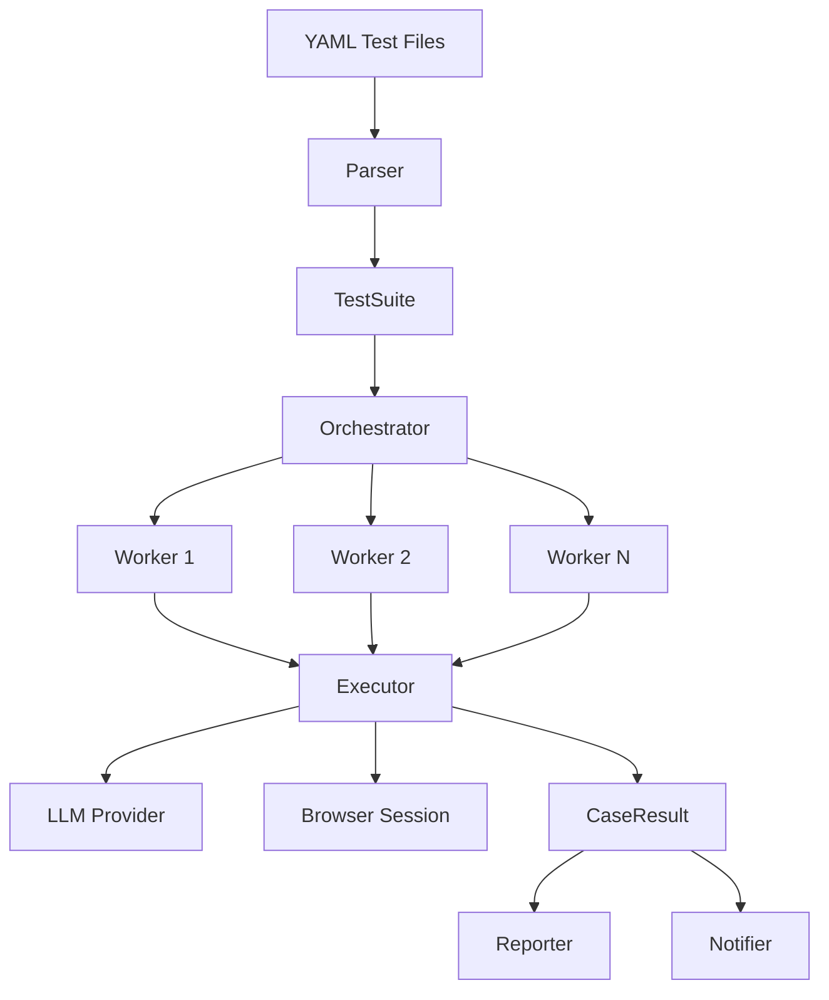

# Architecture Overview

This document describes the overall architecture design, module responsibilities, and data flow of the burunner framework.

---

## Overall Architecture

burunner adopts a layered pipeline architecture with the following core flow:

```
YAML Files → Parsing Layer → Scheduling Layer → Execution Layer → Reporting Layer → Notification Layer
```



---

## Core Flow

### 1. YAML Parsing Phase

```
load_files() → load_yaml() → _resolve_extends() → _expand_data_driven_cases() → _apply_variables()
```

- Load and validate YAML file structure
- Parse preset definitions and resolve inheritance
- Expand data-driven cases (CSV/JSON/YAML/inline)
- Parse multi-environment configuration (environments)
- Execute variable substitution (`${var}` / `${func()}`) via Mako template engine

### 2. Case Scheduling Phase

```
run_suite() → Queue + Worker Pool → _run_with_retry() → _run_with_timeout()
```

- Filter cases by tags and name patterns
- Create asyncio Queue for task distribution
- Progressively start Workers (0.3s interval to avoid resource spikes)
- Per-case timeout control
- Auto-retry for INCOMPLETE and ERROR status (FAILED is never retried)

### 3. Case Execution Phase

```
run_case() → create_session() → inject_cookies() → Agent.run() → verdict determination
```

- Create Playwright browser session
- Inject preset cookies (case-level + global-level)
- Build task prompt and invoke browser-use Agent
- Parse Agent output to determine PASSED/FAILED/ERROR
- Auto-capture screenshot on failure

### 4. Reporting Phase

- Real-time console output (printed immediately after each case completes)
- Allure JSON result writing (steps, parameters, token usage, screenshots, attachments)
- Summary statistics (passed/failed/error/elapsed/tokens)

### 5. Notification Phase

- Build notification payload (NotifyPayload)
- Create the corresponding notifier based on configured channel
- Send notification (failure does not block the main flow)

---

## Module Responsibilities

### parser (Parsing Layer)

| File | Responsibility |
| --- | --- |
| `yaml_parser.py` | YAML loading, validation, preset inheritance, data-driven expansion, environment config |
| `models.py` | Data models: `TestCase`, `TestSuite`, `TestTemplate`, `EnvConfig`, `CookieItem` |
| `variables.py` | `${var}` variable substitution and `${func()}` function engine (powered by Mako template) |
| `datasource.py` | Data source loading (CSV/JSON/YAML/inline), row filtering, and variable mapping |

**Key Design Decisions**:
- Preset inheritance via `extends` field, merging steps/tags/config/cookies/variables
- Data-driven expansion creates independent TestCase instances, each named with `[suffix]`
- Variable priority: case-level > preset-level > environment-level > global-level

### runner (Execution Engine)

| File | Responsibility |
| --- | --- |
| `orchestrator.py` | Worker Pool scheduling, Queue task distribution, progressive start, exception isolation |
| `executor.py` | Single case execution orchestration: coordinates session, agent, and verdict modules |
| `agent_runner.py` | Browser-use Agent lifecycle: prompt building, Agent.run() invocation, history parsing |
| `session_manager.py` | Browser session lifecycle: creation, cookie injection, cleanup |
| `verdicts.py` | Verdict determination logic: analyzes agent output to produce PASSED/FAILED/INCOMPLETE/ERROR |
| `result.py` | `CaseResult`, `SuiteResult`, `CaseStatus` data structures |
| `progress.py` | Real-time progress tracker (terminal output) |
| `history_parser.py` | Parses browser-use agent history for token usage, step outcomes, and step-level status tracking |

**Key Design Decisions**:
- Worker Pool pattern (`asyncio.Queue`): tasks distributed on-demand, worker count = min(parallel, case count)
- Timeout control: `asyncio.wait_for` wraps execution, timeout returns ERROR status
- Retry mechanism: retries INCOMPLETE and ERROR status, FAILED (business assertion failure) is never retried
- Exception isolation: a single Worker exception does not affect other Workers

### Step-Level Status Tracking

The `history_parser.py` module implements step-level status tracking via the `extract_step_outcomes()` method. This maps Agent iterations back to user-defined `TestStep` objects, producing a `StepOutcome` for each step.

**`StepOutcome` data model**:

| Field | Type | Description |
| --- | --- | --- |
| `step_index` | `int` | Zero-based index of the TestStep |
| `step_text` | `str` | Original step description text |
| `status` | `str` | `PASSED` / `FAILED` / `INCOMPLETE` |
| `duration` | `float` | Execution duration in seconds |
| `errors` | `list[str]` | Error messages (if any) |
| `actions` | `list[str]` | Browser actions performed |
| `url` | `str \| None` | Page URL at the end of the step |

**Mapping strategy** (`extract_step_outcomes`):

1. **Primary path**: Use `current_plan_item` from each Agent iteration to map iterations to their corresponding TestStep by index
2. **Fallback**: If `current_plan_item` is unavailable (missing field or all values are None), iterations are distributed evenly across steps
3. **Graceful degradation**: If extraction fails entirely, return an empty list — no exception raised, reporting continues with reduced detail

**Data flow**:

```
Agent.run() → AgentHistory iterations
    │
    ▼
HistoryParser.extract_step_outcomes(steps, history)
    │
    ├─ Group iterations by current_plan_item (or evenly distribute)
    ├─ Compute per-step: status, duration, errors, actions, url
    │
    ▼
list[StepOutcome] → CaseResult.step_outcomes
    │
    ▼
AllureReporter → Per-step Allure steps with real status and timing
```

### executor (Executor)

The executor module has been split into focused sub-modules for maintainability:

- **`executor.py`**: Top-level orchestration — coordinates session_manager, agent_runner, and verdicts
- **`agent_runner.py`**: Handles prompt construction, browser-use Agent invocation, and result extraction
- **`session_manager.py`**: Manages Playwright browser session lifecycle (create, configure, teardown)
- **`verdicts.py`**: Encapsulates all verdict determination logic

**Verdict Determination Priority**:

1. Agent returns `{"success": false, ...}` or contains failure keywords → FAILED
2. `history.is_successful() == False` → FAILED
3. Agent exceeded max steps without completing → INCOMPLETE
4. Runtime exception (browser crash / LLM timeout / framework error) → ERROR
5. Otherwise → PASSED (note: when both are unknown, treated as FAILED to avoid false positives)

### llm (LLM Layer)

| Concept | Description |
| --- | --- |
| `ProviderSpec` | Declarative Provider specification (class candidates, default endpoint, env var fallback) |
| `PROVIDER_REGISTRY` | Registry dict containing all Provider ProviderSpecs |
| `_build_instance()` | Unified builder: class resolution → kwargs assembly → API key/endpoint → customizer hook |
| `Customizer` | Strategy hook for Provider-specific logic (e.g., Azure api_version) |

**Supported Providers**:
OpenAI / Azure OpenAI / Anthropic / Google / DeepSeek / Ollama / Grok / Mistral / Alibaba / ModelScope / MoonShot / SiliconFlow / IBM / Unbound

### browser (Browser Layer)

- `session.py`: Wraps Playwright session creation (`create_session`), cookie injection (`inject_cookies`), and session closure (`close_session`)
- Supports multiple browser channels: chromium / chrome / msedge and their dev channels
- Only Chromium-based browsers are supported (browser-use limitation)

### reporter (Reporting Layer)

| File | Responsibility |
| --- | --- |
| `allure_reporter.py` | Allure JSON format result file generation |
| `console.py` | Real-time console output (per-line progress + summary) |
| `base.py` | Reporter base class definition |
| `registry.py` | Reporter registry |

### notifier (Notification Layer)

| File | Responsibility |
| --- | --- |
| `base.py` | `BaseNotifier` abstract base class + `NotifyPayload` definition |
| `factory.py` | Registry `NOTIFIER_REGISTRY` + factory function `create_notifier()` |
| `wecom.py` | WeCom Webhook (Markdown format) |
| `feishu.py` | Feishu message card |
| `dingtalk.py` | DingTalk Markdown |

### exceptions (Exception Hierarchy)

```
BurunnerError (root exception)
├── ConfigurationError (config error, non-recoverable)
│   └── YamlParseError / LLMProviderError
└── ExecutionError (execution error)
    ├── TransientError (temporary, retryable)
    │   ├── BrowserError
    │   └── LLMError
    └── PermanentError (permanent, should not retry)
```

---

## Configuration Priority

```
CLI params > YAML environment config > YAML top-level config > .env variables > defaults
```

`RunnerConfig` uses chained merging:

```python
cfg = RunnerConfig.from_env()          # .env + defaults
    .merge_yaml_config(suite.yaml_config)  # YAML top-level config
    .merge_env_config(active_env_config)   # Environment config
    .with_overrides(...)                   # CLI params
```

---

## Data Flow Overview

```
[YAML Files]
    │
    ▼
[YamlParser] ──→ TestSuite { cases[], variables{}, environments{}, templates{} }
    │
    ▼
[RunnerConfig] ──→ Merged config (.env + yaml + env + CLI)
    │
    ▼
[Orchestrator] ──→ asyncio Queue + Worker Pool
    │
    ├─→ [Worker 1] ──→ run_case() ──→ CaseResult
    ├─→ [Worker 2] ──→ run_case() ──→ CaseResult
    └─→ [Worker N] ──→ run_case() ──→ CaseResult
    │
    ▼
[SuiteResult] ──→ { case_results[], total_elapsed }
    │
    ├─→ [Console] ──→ Real-time output + summary
    ├─→ [AllureReporter] ──→ allure-results/*.json
    └─→ [Notifier] ──→ WeCom / Feishu / DingTalk
```
