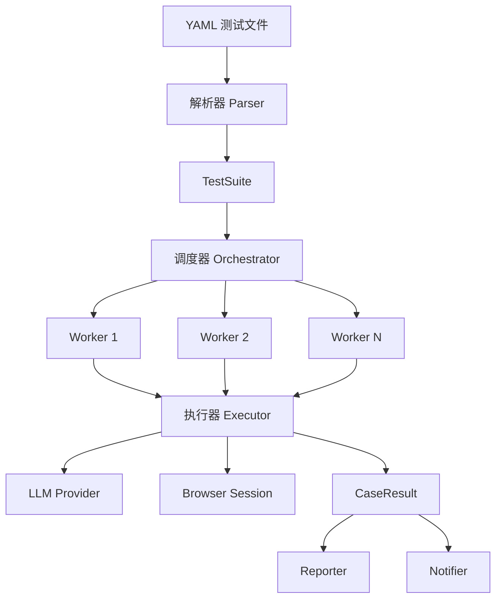

# 架构概览

本文档描述 burunner 框架的整体架构设计、模块职责和数据流。

---

## 整体架构

burunner 采用分层流水线架构，核心流程为：

```
YAML 文件 → 解析层 → 调度层 → 执行层 → 报告层 → 通知层
```



---

## 核心流程

### 1. YAML 解析阶段

```
load_files() → load_yaml() → _resolve_extends() → _expand_data_driven_cases() → _apply_variables()
```

- 加载并校验 YAML 文件结构
- 解析预设（presets）定义并合并继承
- 展开数据驱动用例（CSV/JSON/YAML/内联）
- 解析多环境配置（environments）
- 执行变量替换（`${var}` / `${func()}`）

### 2. 用例调度阶段

```
run_suite() → Queue + Worker Pool → _run_with_retry() → _run_with_timeout()
```

- 按标签和名称过滤用例
- 创建 asyncio Queue 分发任务
- 渐进启动 Worker（间隔 0.3s 避免资源尖峰）
- 单用例超时控制
- ERROR 状态自动重试

### 3. 用例执行阶段

```
run_case() → create_session() → inject_cookies() → Agent.run() → 结果判定
```

- 创建 Playwright 浏览器会话
- 注入预设 Cookie（用例级 + 全局级）
- 构建 task prompt 并调用 browser-use Agent
- 解析 Agent 输出判定 PASSED/FAILED/ERROR
- 失败时自动截图

### 4. 报告输出阶段

- 实时控制台输出（每个用例完成后即时打印）
- Allure JSON 结果写入（步骤、参数、token 用量、截图、附件）
- 汇总统计（通过/失败/错误/耗时/token）

### 5. 通知发送阶段

- 构建通知载荷（NotifyPayload）
- 根据配置通道创建对应通知器
- 发送通知（失败不阻断主流程）

---

## 模块职责

### parser（解析层）

| 文件 | 职责 |
| --- | --- |
| `yaml_parser.py` | YAML 加载、校验、预设继承解析、数据驱动展开、环境配置处理 |
| `models.py` | 数据模型：`TestCase`, `TestSuite`, `TestTemplate`, `EnvConfig`, `CookieItem` |
| `variables.py` | `${var}` 变量替换与 `${func()}` 内置函数调用引擎 |
| `datasource.py` | 数据源加载（CSV/JSON/YAML/内联），数据行过滤与变量映射 |

**关键设计**：
- 预设继承通过 `extends` 字段引用，合并步骤/tags/config/cookies/variables
- 数据驱动展开为独立 TestCase 实例，每行数据生成带 `[suffix]` 的命名用例
- 变量优先级：用例级 > 预设继承级 > 环境级 > 全局级

### runner（执行引擎）

| 文件 | 职责 |
| --- | --- |
| `orchestrator.py` | Worker Pool 并发调度、Queue 任务分发、渐进启动、异常隔离 |
| `executor.py` | 单用例执行：浏览器会话 → Agent 运行 → 结果判定 → 截图 |
| `result.py` | `CaseResult`, `SuiteResult`, `CaseStatus` 数据结构 |
| `progress.py` | 实时进度跟踪器（终端输出） |

**关键设计**：
- Worker Pool 模式（`asyncio.Queue`）：任务按需分发，Worker 数量 = min(parallel, 用例数)
- 超时控制：`asyncio.wait_for` 包裹执行，超时返回 ERROR 状态
- 重试机制：仅对 ERROR 状态重试，FAILED（业务断言失败）不重试
- 异常隔离：单个 Worker 异常不影响其他 Worker

### executor（执行器）

**结果判定优先级**：

1. Agent 返回 `{"success": false, ...}` 或含"测试失败" → FAILED
2. `history.is_successful() == False` → FAILED
3. 运行期异常（浏览器崩溃/LLM 超时/框架异常） → ERROR
4. 其余 → PASSED（注意：双重未知时视为 FAILED，避免误报）

### llm（LLM 层）

| 概念 | 说明 |
| --- | --- |
| `ProviderSpec` | 声明式 Provider 规格（类候选、默认端点、参数名、是否需 API key） |
| `PROVIDER_REGISTRY` | 注册表字典，所有 Provider 的 ProviderSpec 集合 |
| `_build_instance()` | 统一构建逻辑：类解析 → kwargs 组装 → API key/endpoint → customizer hook |
| `Customizer` | 策略钩子，特殊 Provider 的额外逻辑（如 Azure api_version） |

**支持的 Provider**：
OpenAI / Azure OpenAI / Anthropic / Google / DeepSeek / Ollama / Grok / Mistral / Alibaba / ModelScope / MoonShot / SiliconFlow / IBM / Unbound

### browser（浏览器层）

- `session.py`：封装 Playwright 会话创建（`create_session`）、Cookie 注入（`inject_cookies`）、会话关闭（`close_session`）
- 支持多浏览器 channel：chromium / chrome / msedge 及其开发通道
- 仅支持 Chromium 内核（browser-use 限制）

### reporter（报告层）

| 文件 | 职责 |
| --- | --- |
| `allure_reporter.py` | Allure JSON 格式结果文件生成 |
| `console.py` | 控制台实时输出（单行进度 + 汇总） |
| `base.py` | 报告器基类定义 |
| `registry.py` | 报告器注册表 |

### notifier（通知层）

| 文件 | 职责 |
| --- | --- |
| `base.py` | `BaseNotifier` 抽象基类 + `NotifyPayload` 载荷定义 |
| `factory.py` | 注册表 `NOTIFIER_REGISTRY` + 工厂函数 `create_notifier()` |
| `wecom.py` | 企业微信 Webhook（Markdown 格式） |
| `feishu.py` | 飞书消息卡片 |
| `dingtalk.py` | 钉钉 Markdown |

### exceptions（异常体系）

```
BurunnerError（根异常）
├── ConfigurationError（配置错误，不可恢复）
│   └── YamlParseError / LLMProviderError
└── ExecutionError（执行错误）
    ├── TransientError（临时错误，可重试）
    │   ├── BrowserError
    │   └── LLMError
    └── PermanentError（永久错误，不应重试）
```

---

## 配置优先级

```
CLI 参数 > YAML 环境 config > YAML 顶层 config > .env 环境变量 > 默认值
```

`RunnerConfig` 通过链式合并实现：

```python
cfg = RunnerConfig.from_env()          # .env + 默认值
    .merge_yaml_config(suite.yaml_config)  # YAML 顶层 config
    .merge_env_config(active_env_config)   # 环境 config
    .with_overrides(...)                   # CLI 参数
```

---

## 数据流概览

```
[YAML Files]
    │
    ▼
[YamlParser] ──→ TestSuite { cases[], variables{}, environments{}, templates{} }
    │
    ▼
[RunnerConfig] ──→ 合并配置（.env + yaml + env + CLI）
    │
    ▼
[Orchestrator] ──→ asyncio Queue + Worker Pool
    │
    ├─→ [Worker 1] ──→ run_case() ──→ CaseResult
    ├─→ [Worker 2] ──→ run_case() ──→ CaseResult
    └─→ [Worker N] ──→ run_case() ──→ CaseResult
    │
    ▼
[SuiteResult] ──→ { case_results[], total_elapsed }
    │
    ├─→ [Console] ──→ 实时输出 + 汇总
    ├─→ [AllureReporter] ──→ allure-results/*.json
    └─→ [Notifier] ──→ 企业微信/飞书/钉钉
```
